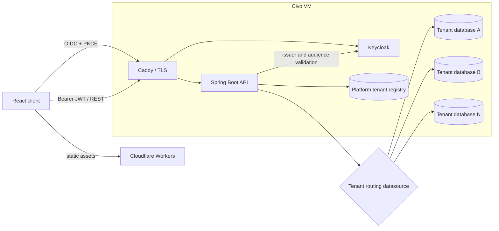
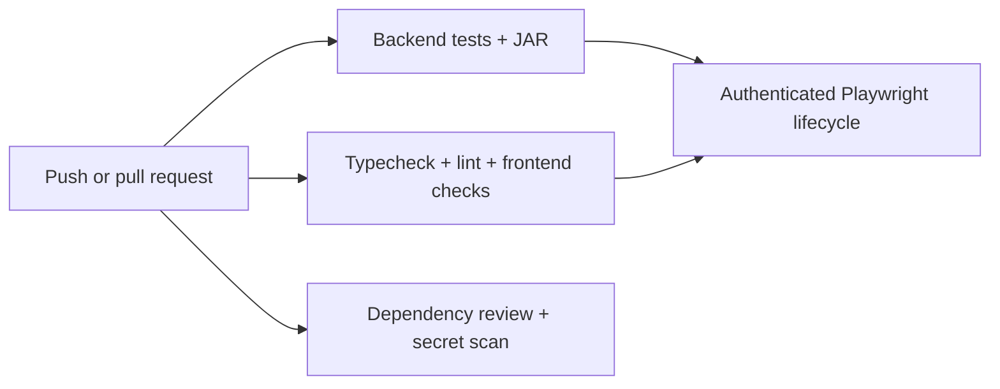

# MultiBooking

> A multi-tenant scheduling platform for coordinating customers, services, staff, locations, and shared resources.

[](https://github.com/joonasmustonen-dev/multi-booking-saas/actions/workflows/ci.yml)
[](https://multibooking.org)

**Live site:** [multibooking.org](https://multibooking.org)

MultiBooking is a full-stack portfolio project built around a scheduling problem that becomes difficult as soon as one booking can depend on several independently available assignments. A service can require a staff member, a location, a resource, or any supported combination of the three. The platform generates only complete combinations, validates the selected combination again when it is saved, and relies on PostgreSQL constraints as the final guard against concurrent double-booking.

The project covers the complete path from domain modeling and API design to a responsive operations interface, authenticated browser tests, containerized infrastructure, CI, and a public cloud deployment.

**Project status:** active engineering project and development preview. The hosted environment is provided for demonstration, has no public registration, and should not be used for real customer data.

## What this project demonstrates

| Area | Implementation |
| --- | --- |
| Domain modeling | Services independently declare staff, location, and resource assignments as required, optional, or forbidden. Eligibility and requirement rules remain separate. |
| Scheduling | Availability intersects recurring hours, dated staff rotas, closures, time off, extra availability, service eligibility, location assignments, booking policies, and existing appointments. |
| Concurrency | Appointment creation and rescheduling revalidate inside a transaction; PostgreSQL `tstzrange` exclusion constraints reject races for staff, locations, and resources. |
| Multi-tenancy | A platform registry selects a dedicated PostgreSQL database from a trusted JWT tenant claim. Tenant context is request-scoped and cleared after every request. |
| Authentication | Keycloak OpenID Connect, Authorization Code flow with PKCE S256, Spring Security resource-server validation, audience checks, and role-based authorization. |
| Privacy controls | Customer export, contact-detail or full erasure, processing restriction, legal hold, retention preview/apply workflows, and security audit events. |
| Event-driven workflow | Appointment cancellation publishes an event that matches released capacity against eligible waitlist entries in a new transaction. |
| Delivery | GitHub Actions, disposable PostgreSQL and Keycloak services, Playwright browser tests, Docker Compose, Caddy TLS termination, Cloudflare Workers, and Civo deployment assets. |

## Architecture



The frontend is a static React application. Keycloak owns authentication, while Spring Security validates access tokens and establishes the tenant context. Platform metadata lives in a small registry database; operational data is physically separated into one database per tenant. Flyway migrates the platform schema and every active tenant schema during startup.

## Core scheduling model

A bookable slot is more than a timestamp. It is a complete assignment tuple:

```text
(start, end, staff?, location?, resource?)
```

Each service defines:

- which staff, locations, and resources are eligible;
- whether each assignment category is `REQUIRED`, `OPTIONAL`, or `FORBIDDEN`;
- duration, price, and booking status defaults.

Availability is computed from the intersection of every selected assignment's schedule. Blocked exceptions take precedence over recurring hours, while extra-availability exceptions can open additional time. Staff can be restricted to assigned locations or configured as free agents.

Saving an appointment repeats the assignment and availability checks. The transaction flushes immediately so a conflicting PostgreSQL exclusion constraint becomes an HTTP `409 Conflict` instead of a silent double-booking. Rescheduling uses the same path while excluding the appointment being moved.

## Product capabilities

- **Calendar and appointments** — weekly and agenda views, searchable filters, complete assignment selection, rescheduling, cancellation, status transitions, and detailed customer context.
- **Services** — duration, pricing, descriptions, eligible assignments, and independent requirement policies for staff, locations, and resources.
- **Staff scheduling** — contact details, activation, location assignments, recurring hours, time off, split shifts, and dated weekly rotas with copy/reset operations.
- **Locations and resources** — independent opening hours, closures, extra availability, activation, and assignment management.
- **Customers** — bounded search, contact details, operational notes, booking history, attendance context, and preferred staff.
- **Waitlists** — service and time-range requests, optional staff/location preferences, notification consent, cancellation matching, deduplicated offers, expiry, acceptance, and removal states.
- **Dashboard and settings** — operational summaries, today's scheduled team, booking policies, timezone, currency, calendar range, and slot spacing.
- **Privacy administration** — paginated data export, erasure controls, legal holds, processing restrictions, retention policies, and auditable administrative actions.

## Technology

### Backend

- Java 21 and Spring Boot 4
- Spring Web MVC, Spring Data JPA, Spring Security, and Bean Validation
- PostgreSQL 16 and Flyway
- OAuth 2.0 resource server with Keycloak-issued JWTs
- Maven and JUnit 5

### Frontend

- React 19 and TypeScript 6
- Vite 8
- TanStack Query
- React Router
- Playwright
- Custom responsive component and design system CSS

### Infrastructure and delivery

- Docker Compose for development, E2E, and single-VM staging
- Caddy for HTTPS and reverse proxying
- Cloudflare Workers Static Assets for the frontend
- Civo Compute for the containerized backend stack
- GitHub Actions, Dependabot, dependency review, and Gitleaks

## Quality strategy

The test suite focuses on boundaries where scheduling systems usually fail:

- tenant selection and cross-tenant isolation;
- JWT claims, audience validation, roles, and suspended tenants;
- required, optional, and forbidden assignment combinations;
- overlapping staff, location, and resource bookings;
- recurring rules, blocked periods, extra availability, and weekly rotas;
- cancellation capacity and waitlist offer lifecycle;
- customer privacy, retention, erasure, and legal-hold behavior;
- appointment create, reschedule, and cancel flows through a real Keycloak login in Chromium.

GitHub Actions creates disposable databases, applies the real Flyway migrations, builds both applications, runs the backend and frontend suites, and then starts isolated PostgreSQL and Keycloak containers for Playwright. Failure artifacts include test reports, browser traces, screenshots, videos, and service logs.



## Repository layout

```text
backend/
  src/main/java/              REST APIs, domain services, security, tenant routing
  src/main/resources/db/      Platform and tenant Flyway migrations
  src/test/                   Unit and PostgreSQL integration tests
frontend/
  src/api/                    Authenticated API client
  src/auth/                   Keycloak browser integration
  src/components/             Shared UI controls
  src/features/               Domain-oriented React features
  e2e/                        Playwright booking lifecycle
infrastructure/
  compose/                    Local PostgreSQL and Keycloak
  e2e/                        Isolated browser-test infrastructure
  civo/                       Staging Compose, Caddy, backups, realm import
scripts/                      Database bootstrap and E2E orchestration
docs/                         Focused operational documentation
```

## Run the verification suites

Prerequisites: Java 21, Node.js 24, Docker with Compose v2, and Git Bash or another Bash environment.

The browser suite is the fastest way to exercise the complete system with disposable infrastructure. It starts PostgreSQL and Keycloak, imports a test realm, migrates and seeds the databases, starts the API and frontend, performs the authenticated booking lifecycle, and removes its containers and volumes afterward.

```bash
git clone https://github.com/joonasmustonen-dev/multi-booking-saas.git
cd multi-booking-saas/frontend
npm ci
npx playwright install --with-deps chromium
cd ..
bash scripts/run-e2e.sh
```

Run the individual project checks with an initialized local PostgreSQL environment:

```bash
# Backend
cd backend
./mvnw clean verify

# Frontend
cd ../frontend
npm ci
npm run test:assignments
npm run lint
npm run build
```

See [CI setup and browser-test troubleshooting](docs/ci.md) for the isolated test lifecycle and artifact locations.

## Local development

Start the development infrastructure:

```bash
docker compose -f infrastructure/compose/docker-compose.dev.yml up -d
```

Start the backend once so Flyway creates the platform registry, then provision the two local tenant databases:

```bash
cd backend
./mvnw spring-boot:run
# Stop the application after startup, then return to the repository root.

cd ..
docker compose -f infrastructure/compose/docker-compose.dev.yml exec -T postgres \
  psql -U booking -d platform_db -v ON_ERROR_STOP=1 < scripts/setup-dev-tenants.sql
```

Configure a local Keycloak `booking` realm with the `booking-frontend` public client, PKCE S256, the `TENANT_ADMIN`, `STAFF`, and `CUSTOMER` roles, and a `tenant_id` access-token claim. Local redirect and web origins are `http://localhost:5173/*` and `http://localhost:5173`.

Start the applications in separate terminals:

```bash
# Backend
cd backend
./mvnw spring-boot:run

# Frontend
cd frontend
npm ci
npm run dev -- --host localhost --port 5173 --strictPort
```

Open `http://localhost:5173`. Development credentials in the Compose files are intentionally local-only and must never be reused in a deployment.

## Deployment

The demonstration topology separates the static frontend from the stateful application services:

- Cloudflare Workers serves the Vite build with SPA fallback routing.
- Caddy terminates TLS for `api.multibooking.org` and `auth.multibooking.org`.
- Spring Boot, Keycloak, and PostgreSQL run as containers on a Civo VM.
- PostgreSQL and application ports remain private to Docker networks; only SSH, HTTP, and HTTPS are exposed.
- Production frontend endpoints are compiled from `frontend/.env.production`.
- The repository contains backup and update scripts for the staging VM.

The checked-in deployment is intentionally a single-VM staging design rather than a high-availability production claim. See the [Civo deployment guide](infrastructure/civo/README.md) for DNS, secrets, TLS, provisioning, backups, and update procedures.

## Security and privacy notes

This project implements technical controls that are useful in privacy-sensitive systems, but software features alone do not make a deployment GDPR compliant. A real operator would still need documented lawful bases, processor agreements, retention decisions, incident handling, access governance, and verified backup/restore and deletion procedures.

The hosted instance is a development preview. Do not enter real personal, medical, payment, or confidential business data.

## Current boundaries

- Tenant provisioning is an administrative infrastructure operation; self-service onboarding is not implemented.
- Waitlist offers are tracked and deduplicated, while external email/SMS delivery is not yet connected.
- Payments, public customer registration, billing, and subscription management are outside the current scope.
- The included deployment favors a reviewable, low-cost staging topology over multi-region availability.

---

Built by [joonasmustonen-dev](https://github.com/joonasmustonen-dev) as an end-to-end demonstration of backend design, frontend product work, database correctness, identity integration, automated testing, and cloud delivery.
